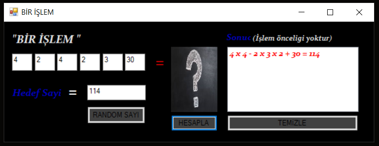
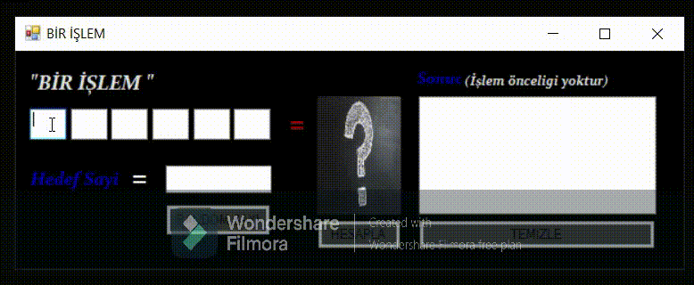
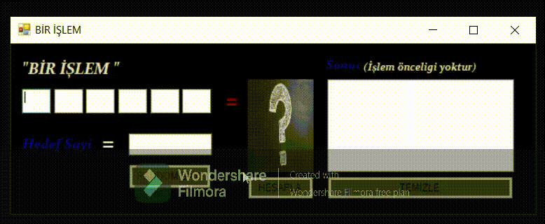

# Bir-Kelime-Bir-Islem-Islem-Kismi --- (Number Game) ---

  
Çoğumuzun bildiği bir kelime bir işlem oyununun işlem kısmı olarak düşünülebilir. Bu uygulama kullanıcının girdiği(5 tane bir haneli, 1 tane çift haneli ve hedef sayı) veya random olarak alınan bu sayıları kullanarak hedef sayıya ulaşmaktadır.

<strong> --> This application reaches the target number by using the numbers entered by the user (5 one digit, 1 double digit and target number) or randomly received.</strong>

<ul>
  <li>Kullanıcı Tarafından Sayıların Elle Girilmesi</li>  
</ul>  

<ul>
  <li>Uygulama Tarafında Sayıların Random Olarak Verilmesi</li>  
</ul>  

